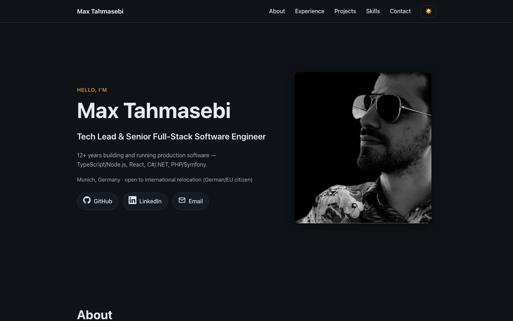
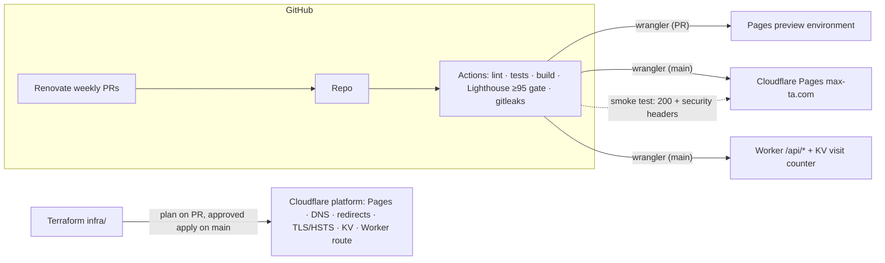

# max-ta.com

Personal portfolio of **Max Tahmasebi** — Tech Lead & Senior Full-Stack
Software Engineer in Munich. A single-page Angular app with smooth-scroll
sections (hero, about, experience, projects, skills, contact), dark mode by
default with a light toggle, hand-written SCSS on CSS custom properties, and
no CSS framework, fonts, or trackers. Built to WCAG 2.1 AA, with full SEO
metadata, schema.org Person markup, and an [`llms.txt`](public/llms.txt) so AI
crawlers get an accurate professional summary. The first version of this site
(Angular 12, also built by me) lives on in the git history.

**Live: [max-ta.com](https://max-ta.com)**



## Tech stack

- [Angular 21](https://angular.dev) — standalone components, signals, zoneless
  change detection, `@if`/`@for` control flow
- SCSS with CSS custom properties for dark/light theming (no framework)
- Optimized WebP photography, system font stack, ~43 kB transferred JS
- Vitest for unit tests

## Local development

```bash
npm install
npm start        # dev server at http://localhost:4200
npm run build    # production build → dist/masoud-tahmasebi-spa/browser
npm test         # unit tests (vitest)
```

Deploys as a static site; point your host (e.g. Cloudflare Pages) at the
`dist/masoud-tahmasebi-spa/browser` output directory.

## How this site ships

[](https://github.com/maca-sys/masoudtahmasebi-landscape/actions/workflows/deploy.yml)
[](https://github.com/maca-sys/masoudtahmasebi-landscape/actions/workflows/infra.yml)


Deliberately production-grade for a static site — that is the point.



- **Terraform (`infra/`)** manages the whole Cloudflare setup — Pages project,
  domains, DNS, www→apex redirect, TLS floor, HSTS, KV, Worker route — so
  nothing about the platform lives only in a dashboard.
- **State** lives in HCP Terraform's free tier: the one no-cost option with
  real remote state, locking, and encryption; the tradeoff is one extra
  account, which beats committing state (leaks secrets) or gitignoring it
  (breaks CI).
- **GitHub Actions** owns every deploy: PRs get preview environments with the
  URL commented, `main` ships to production only after a Lighthouse CI gate
  fails anything under 95 in any category.
- **A Worker** (`worker/`) serves `/api/resume` from the same data module the
  site renders — one source of truth — and `/api/visits`, a KV counter that
  stores a single integer and nothing per-visitor, GDPR-clean by design.
- **Security headers** (`public/_headers`) enforce a CSP with no inline
  scripts, verified by a post-deploy smoke test in CI.
- **Renovate** files weekly grouped updates with automerged devDependency
  patches: the previous version of this site rotted on Angular 12 for years —
  never again.
- **Preview environments as proof:** every PR's checks include a
  `Comment preview URL` step; open any merged PR to find its live preview link.

## Suggested GitHub repo settings

**Description:**

> Personal portfolio of Max Tahmasebi — Tech Lead & Senior Full-Stack Engineer.
> Angular 21, hand-written SCSS, WCAG 2.1 AA, AI-crawler friendly. Live at max-ta.com

**Topics:** `portfolio` `angular` `typescript` `scss` `accessibility` `wcag`
`seo` `cloudflare-pages` `personal-website`
